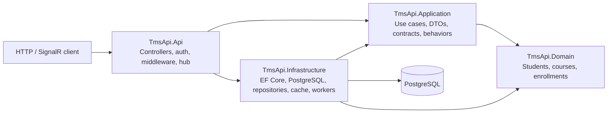

# TmsApi | Training Management System

An API-first training management system for course catalogs, student enrollment workflows, instructor decisions, and academic records.


> This repository contains the TmsApi backend. No frontend project is included in this solution.

## Screenshots

|                                     API reference                                      |                                 Course workflow                                  |                                 Transcript workflow                                 |
| :------------------------------------------------------------------------------------: | :------------------------------------------------------------------------------: | :---------------------------------------------------------------------------------: |
| <!-- Replace with actual screenshot path: API reference --> **Screenshot placeholder** | <!-- Replace with actual screenshot path: courses --> **Screenshot placeholder** | <!-- Replace with actual screenshot path: transcript --> **Screenshot placeholder** |

## Key Features

- Course catalog with search, pagination, and instructor-scoped course management.
- Student enrollment requests with capacity and duplicate checks; instructor/admin approval and rejection.
- Identity registration, JWT authentication, refresh-token rotation, and role-based access.
- Grade entry, academic reporting, and SignalR updates for grades and enrollment decisions.
- Asynchronous plain-text transcript generation with status polling, optional idempotency keys, and SignalR notifications.
- URL-based API versioning, request validation, Problem Details errors, rate limiting, and health checks.

## Architecture

The solution separates HTTP delivery, use cases, domain entities, and external concerns into four projects. Application workflows use MediatR and repository contracts where implemented; some controllers also access the EF Core context directly.



| Project                 | Responsibility in this solution                                                                                                             |
| ----------------------- | ------------------------------------------------------------------------------------------------------------------------------------------- |
| `TmsApi.Api`            | ASP.NET Core endpoints, authentication/authorization, middleware, API versioning, SignalR, and service registration.                        |
| `TmsApi.Application`    | Enrollment use cases, request/response models, validation and logging pipeline behaviors, and service/repository interfaces.                |
| `TmsApi.Domain`         | Core student, course, enrollment, and user entities and enrollment state.                                                                   |
| `TmsApi.Infrastructure` | EF Core persistence and migrations, PostgreSQL integration, repositories, HybridCache service, external HTTP client, and transcript worker. |

This describes the projects present in this repository; no `RealEstateApi` project or solution is included here.

## API Surface

| Area               | Representative routes                                                          |
| ------------------ | ------------------------------------------------------------------------------ |
| Authentication     | `POST /api/auth/register`, `/api/auth/login`, `/api/auth/refresh`              |
| Courses            | `/api/courses`; versioned reads at `/api/v1.0/courses` and `/api/v2.0/courses` |
| Enrollments        | `/api/v2.0/enrollments`                                                        |
| Transcripts        | `/api/v2.0/transcripts`                                                        |
| Grades & reporting | `/api/grades`, `/api/reporting`                                                |
| Realtime           | SignalR hub at `/hubs/tms`                                                     |

V1 responses are marked with deprecation and sunset headers. OpenAPI and Scalar are enabled in Development. See [API versioning policy](docs/api-versioning-policy.md) for the documented compatibility policy.

## Tech Stack

| Area                       | Technologies                                                           |
| -------------------------- | ---------------------------------------------------------------------- |
| Runtime                    | .NET 10, ASP.NET Core                                                  |
| Data                       | Entity Framework Core, PostgreSQL, Npgsql                              |
| Identity                   | ASP.NET Core Identity, JWT bearer authentication                       |
| Application                | MediatR, FluentValidation, dependency injection                        |
| Realtime & background work | SignalR, hosted services, `System.Threading.Channels`                  |
| Caching & resilience       | .NET HybridCache, Polly                                                |
| Observability              | OpenTelemetry (OTLP), health checks, structured JSON console logs      |
| Tests                      | xUnit, ASP.NET Core integration testing, EF Core InMemory, NSubstitute |

## Project Structure

```text
TmsApi.Api/             HTTP API, auth, middleware, SignalR, configuration
TmsApi.Application/     Use cases, DTOs, contracts, validation behaviors
TmsApi.Domain/          Core entities and enrollment states
TmsApi.Infrastructure/  Persistence, repositories, cache, workers, integrations
TmsApi.Tests/           Unit and API integration tests
docs/                   API versioning policy and project evidence
```

## Getting Started

**Prerequisites:** .NET 10 SDK and a reachable PostgreSQL database.

Set the database connection string and a randomly generated JWT signing key of at least 32 bytes as user secrets; keep real credentials out of committed configuration. Development configuration supplies the JWT issuer and audience.

```powershell
dotnet user-secrets set "ConnectionStrings:TmsDatabase" "Host=localhost;Port=5432;Database=tms;Username=postgres;Password=<your-password>" --project TmsApi.Api
dotnet user-secrets set "Jwt:Key" "<random-signing-key>" --project TmsApi.Api
dotnet restore TmsApi.sln
dotnet run --project TmsApi.Api
```

The API applies EF Core migrations at startup. Development startup also seeds sample academic data. Scalar and OpenAPI are available in Development; PostgreSQL must be configured and running.

Run the test suite:

```powershell
dotnet test TmsApi.sln
```

## Engineering Highlights

- MediatR pipeline behaviors centralize request validation and structured request logging for handler-based workflows.
- Course ownership is enforced with resource-based authorization; API limits are partitioned by anonymous/free/paid API-key tiers.
- Transcript processing uses a bounded channel and hosted worker; transcript status, idempotency mappings, and file content are currently in memory and are lost on restart.
- Polly timeout, retry, and circuit-breaker policies wrap the certificate HTTP client. Its configured target is the API's local fixture endpoint, not a production provider.
- Liveness and PostgreSQL readiness are exposed separately; OpenTelemetry exports traces and metrics through OTLP.

## Future Improvements

- Persist transcript jobs and generated files so processing state survives restarts.
- Replace the certificate fixture with a configured production provider.
